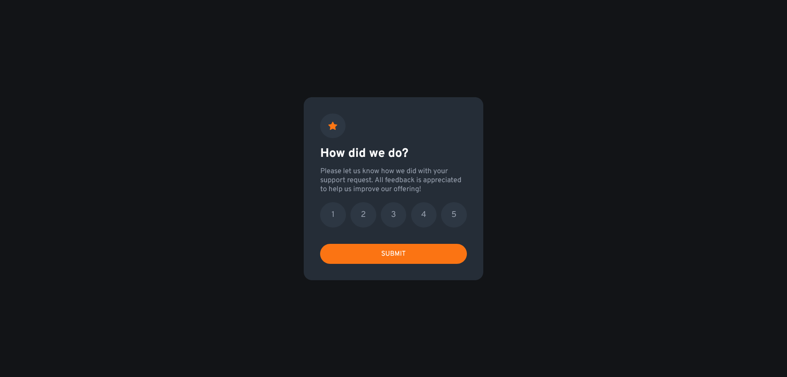
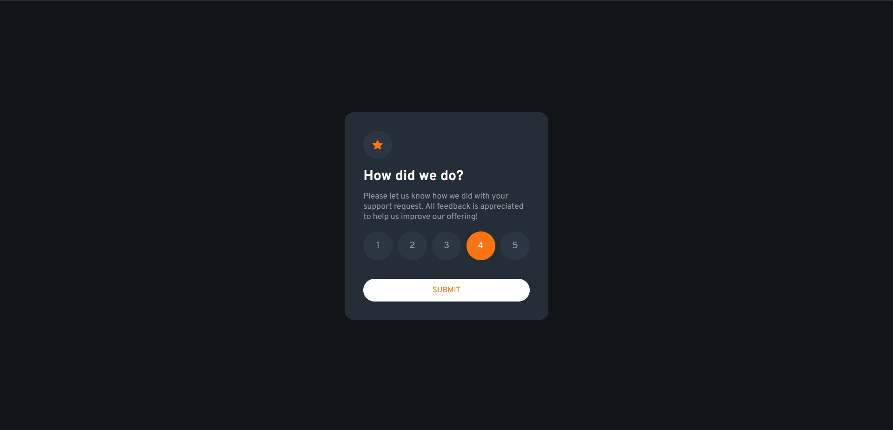
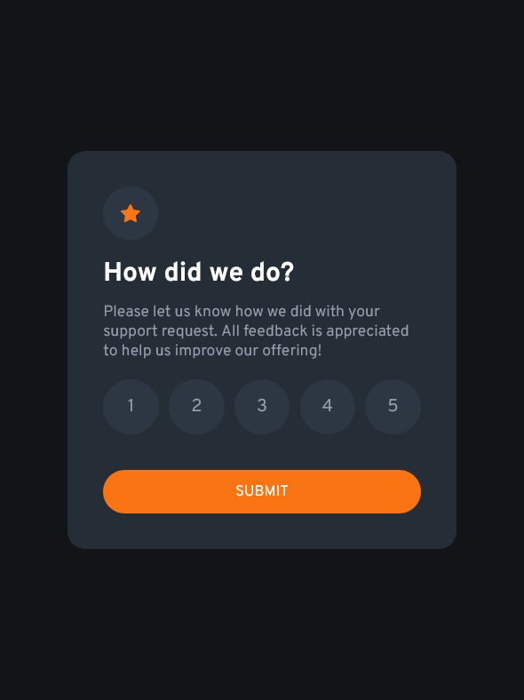

# Frontend Mentor - Interactive rating component solution

This is a solution to the [Interactive rating component challenge on Frontend Mentor](https://www.frontendmentor.io/challenges/interactive-rating-component-koxpeBUmI). Frontend Mentor challenges help you improve your coding skills by building realistic projects. 

## Table of contents

- [The challenge](#the-challenge)
- [Screenshot](#screenshot)
- [Links](#links)
- [Built with](#built-with)
- [Author](#author)

### The challenge

Users should be able to:

- View the optimal layout for the app depending on their device's screen size
- See hover states for all interactive elements on the page
- Select and submit a number rating
- See the "Thank you" card state after submitting a rating

### Screenshot

- Different Views

### Links

- Live Site URL: [Github Pages](https://alphavamp.github.io/interactive-rating-component-main/)

### Built with

- Semantic HTML5 markup
- CSS custom properties
- Flexbox
- JavaScript
- Visual Studio Code

## Author

- Github - [AlphaVamp](https://github.com/AlphaVamp)
- Frontend Mentor - [Paresh2421](https://www.frontendmentor.io/profile/Paresh2421)
- LinkedIn - [Paresh Nair](https://www.linkedin.com/in/paresh-nair-1987b4254)

